<div align="center">

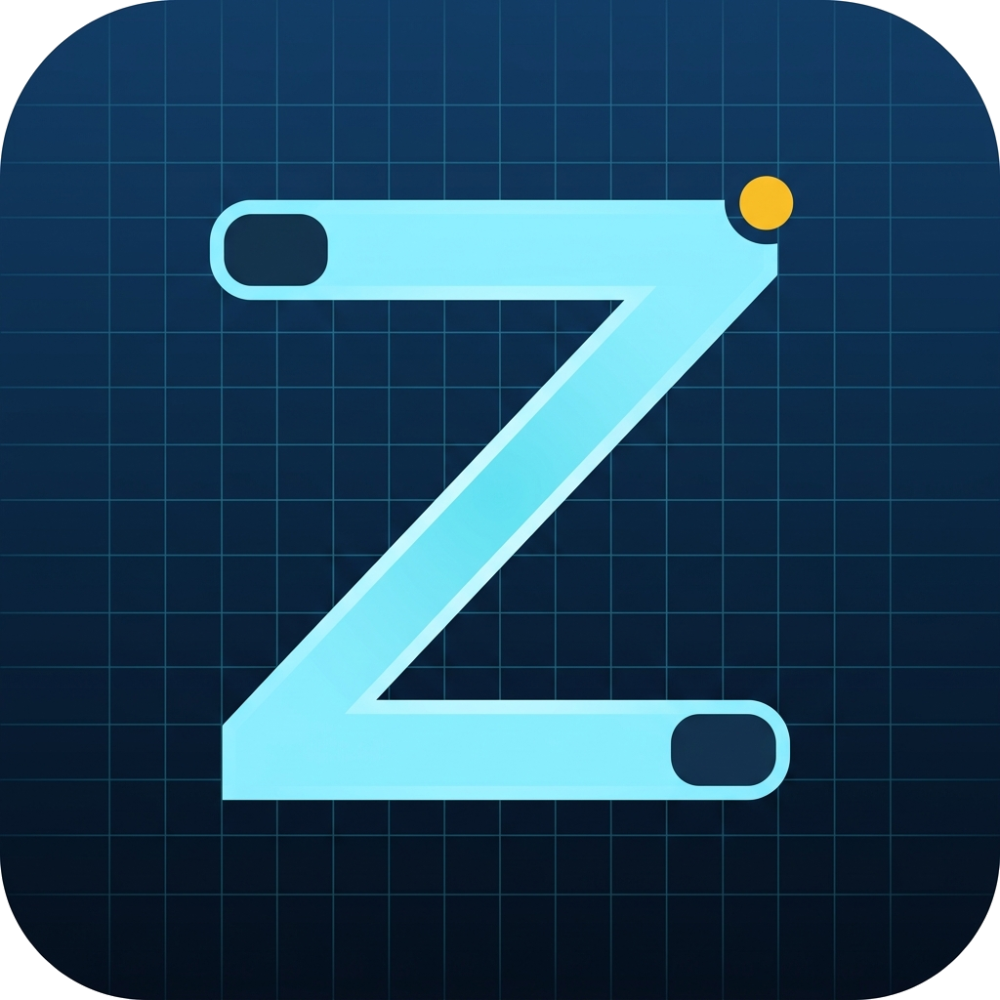

# ZDraft

**Diagrams as code, with a canvas you are allowed to touch.**

A free, offline desktop diagram editor for **Mermaid**, **Graphviz**, **D2** and
**PlantUML** — with drag-and-drop layout that survives the next render.

<p>
  
  
  
</p>

You write Mermaid, Graphviz, D2 or PlantUML. ZDraft draws it. Then you grab the
box auto-layout put in a stupid place and move it — and the move *stays*, in a
small readable file next to your source.

Your diagram file is never rewritten. GitHub still renders it. The diff a
reviewer reads is still text.

</div>

<p align="center">
  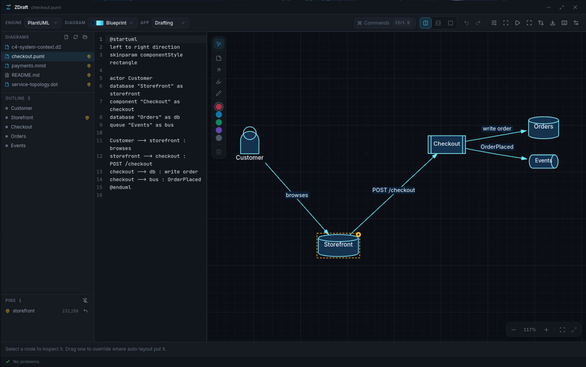
</p>

---

## Contents

- [Why this exists](#why-this-exists) · [Install](#install) · [Your first diagram](#your-first-diagram)
- [The four engines](#the-four-engines) · [What ZDraft can draw](#what-zdraft-can-draw)
- [Source and canvas are one document](#source-and-canvas-are-one-document)
- [Moving things](#moving-things--the-whole-point) · [The layout file](#the-layout-file)
- [When something is wrong](#when-something-is-wrong)
- [Marking up a diagram](#marking-up-a-diagram) · [Presenting](#presenting)
- [Comparing with git](#comparing-with-git) · [Tuning the layout](#tuning-the-layout)
- [Templates](#templates-and-starters) · [Importing from draw.io and Excalidraw](#importing-from-drawio-and-excalidraw)
- [Diagrams inside markdown](#diagrams-inside-markdown) · [Exporting](#exporting) · [Themes](#themes)
- [Every button](#every-button) · [Settings](#settings) · [Keyboard shortcuts](#keyboard-shortcuts)
- [The command line](#the-command-line) · [PlantUML setup](#plantuml-setup) · [Questions](#questions)
- [Where things are](#where-things-are) · [Building from source](#building-from-source)

---

## Why this exists

Diagram tools make you pick one of two bad deals.

**Diagram-as-code** — Mermaid, D2, Graphviz, PlantUML — is reviewable in a pull
request and renders natively on GitHub. But the engine decides placement, and
when it puts two boxes on top of each other you cannot nudge them.

**GUI editors** — draw.io, Excalidraw — give you complete control of the layout
and hand back a blob no reviewer can read in a diff.

ZDraft takes the first deal and removes its one flaw. Auto-layout by default,
manual override where you care, **both stored in text**.

When you drag a node, the position goes into `yourdiagram.dot.zlayout.toml`
beside the file. Your source is untouched. Delete the layout file and you are
back to pure auto-layout — there is no hidden state anywhere else.

---

## Install

**Downloads live at [zsync.eu/zdraft](https://zsync.eu/zdraft/)** — not on
GitHub. This repository is the source code; the installers are on the site.

| System | File |
|---|---|
| Linux | `.AppImage` (make it executable and run it), `.deb`, or `.rpm` |
| Windows | `.exe` installer — installs for the current user, no administrator prompt |

Every download has a SHA-256 beside it. The Windows installer is still being
packaged; the Linux three are ready.

Nothing else is required. Graphviz, Mermaid and D2 are built in — there is
nothing to install for them and nothing is downloaded. (PlantUML is the one
exception; see [PlantUML setup](#plantuml-setup).)

ZDraft has **no account, no telemetry and no cloud**. Your files stay on your
machine and nothing is sent anywhere.

---

## Your first diagram

The very first launch opens a short tour instead of leaving you to guess: eight
screens, two of which wait for you to click a box and drag one before they
continue. It takes about a minute and you can leave at any point with `Esc`. To
see it again later, press `Ctrl+K` and choose **Take the tour**.

1. **Open a folder.** The left rail lists every diagram in it.
2. **Make a file** with `Ctrl+N`, or start from a worked example with
   `Ctrl+Shift+N`.
3. **Type on the left, watch the right.** The canvas re-renders as you type.
4. **Drag the box that came out wrong.** That is the part other tools do not let
   you do.
5. **Save with `Ctrl+S`.** Your drag was already saved, separately.

Pointed at an empty folder, ZDraft offers to create the first file rather than
showing you an empty grid.

---

## The four engines

Pick one per file, from the **Engine** menu in the top-left. The file extension
chooses it for you when you open something.

| Engine | Extensions | Ships with ZDraft | Notes |
|---|---|---|---|
| **Graphviz** | `.dot` `.gv` | ✅ Bundled (WebAssembly) | Exact geometry, including edge splines. The most precise layout of the four. |
| **Mermaid** | `.mmd` `.mermaid` | ✅ Bundled | The one most repositories already have. GitHub renders it natively. |
| **D2** | `.d2` | ✅ Bundled (WebAssembly) | Containers, classes and SQL tables. Clean modern syntax. |
| **PlantUML** | `.puml` `.plantuml` `.iuml` | ⚠️ Needs Java | Not bundled — [one click to set up](#plantuml-setup). |

You can rename, relabel, reshape and tune layout in **all four**.

---

## What ZDraft can draw

ZDraft has two renderers and a safety valve.

### Graph diagrams — fully interactive

Every box can be dragged, pinned, aligned and annotated.

Flowcharts · state machines · entity-relationship diagrams · class diagrams ·
C4 (context, container, component, deployment) · service topologies ·
network diagrams · org charts · data pipelines · deployment diagrams · runbooks

Shapes: rectangle, rounded, stadium, circle, ellipse, diamond, hexagon,
cylinder, queue, package, folder, cloud, document, page, person, component,
note, parallelogram, trapezoid, triangle, stored data, and more depending on the
engine.

### Sequence diagrams — interactive in their own way

A sequence diagram has no free 2-D placement, so dragging means something
different and more useful:

- **Drag a lifeline header** to reorder the columns — the single best fix for
  crossing messages.
- **Drag the gap** between two lifelines to widen a column.
- **Drag a message** to change the spacing above it.

### Everything else — read-only, never an error

Gantt charts, pie charts, mindmaps, user journeys, timelines, git graphs,
quadrant charts, Sankey diagrams and the rest render exactly as their engine
draws them, with a banner explaining why they cannot be dragged.

**ZDraft never chokes on a file.** An unmodelled diagram type degrades to a
viewer rather than an error.

---

## Source and canvas are one document

The two panes are wired together in both directions.

- **Click a node** and the cursor jumps to the line that declares it, and
  flashes it.
- **Move the cursor** in the source and the matching node highlights on the
  canvas.
- **`/`** searches nodes by name or label and jumps to one.
- The **Outline** in the left rail lists every node in the file; clicking one
  does the same.

It works in all four languages — none of which hand back source positions, so
ZDraft scans for them itself.

ZDraft also reopens whatever you had open last, at the zoom and position you
left it, so launching it puts you back where you were rather than at a blank
grid.

---

## Moving things — the whole point

<p align="center">
  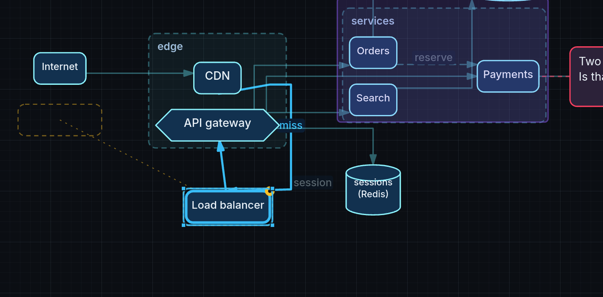
</p>

Grab a box and move it. While you drag it — and whenever it is selected — an
**amber dashed outline** shows where auto-layout wanted it, with a thin line
back, so you can always see how far you have overridden the engine. **Click that
ghost to snap the node back.**

- Nodes track the cursor **1:1**, with no spring and no lag.
- Drag a **subgraph** to move everything inside it.
- **Arrow keys** nudge by 1 px, `Shift` for 10 — never snapped to the grid.
- **`Alt`** while dragging ignores the grid.
- **`P`** pins or releases the selection.
- Select several and use the **align and distribute** buttons in the bar at the
  bottom.

### Edges

- **Drag an edge** to add a bend. Drag the bend to move it, double-click to
  remove it.
- **Drag an edge label** to nudge it out of the way. Double-click puts it back.
- Edges reroute automatically around the nodes you move.

### Pins are never lost quietly

A pin belongs to a node's **id**, not its position — so editing an unrelated
part of your file never disturbs it. If you rename a node, the pin follows. If a
pinned node disappears entirely, the pin is **surfaced in the Pins list with a
one-click repair**, never silently dropped.

Pins are **amber** everywhere in ZDraft. It is the one colour that means exactly
one thing: *you overrode the layout here.*

---

## The layout file

Drag a node and ZDraft writes this beside your diagram:

```toml
version = 1

[pins.lb]
x = 96
y = 320
fingerprint = "box:Load balancer:0"
auto = [48, 269]
```

That is the whole format. One field per line, integer coordinates, sorted — so
when two people move the same node, git shows a conflict in four readable lines
rather than inside a binary blob.

**Your diagram source is never touched by a drag.** `git diff` after an
afternoon of nudging shows an unchanged `.dot` file and a small `.zlayout.toml`.

Delete the layout file and the diagram goes back to pure auto-layout. Nothing
else has to be cleaned up.

> If a merge does go wrong, ZDraft detects the conflict markers and offers to
> resolve it visually — mine, theirs, or both side by side on the canvas.

---

## When something is wrong

The strip along the bottom is where ZDraft tells you. Drag its top edge to make
it taller; double-click to put it back.

| | |
|---|---|
| **Parse errors** | With the line and column. Click to jump the cursor there. |
| **`3 nodes overlap`** | Auto-layout put boxes on top of each other. Right-click one and choose **Separate from neighbours** to push them apart and pin them where they land. |
| **Drift warnings** | *"Auto-layout has moved `orders` a long way since it was pinned."* Your pin still holds, but the diagram has changed underneath it — worth a look before it silently fights you forever. |
| **Orphaned pins** | A pin whose node no longer exists. It appears in the **Pins** list with the id shown and a one-click repair: point it at the renamed node, or drop it. Never removed behind your back. |
| **Merge conflicts** | If two people move the same node and git cannot merge it, ZDraft spots the conflict markers and offers to resolve it visually — mine, theirs, or both side by side on the canvas — instead of making you edit coordinates by hand. |

A file ZDraft cannot parse at all keeps showing the last good render while you
fix it, rather than blanking the canvas on every half-typed line.

---

## Marking up a diagram

<p align="center">
  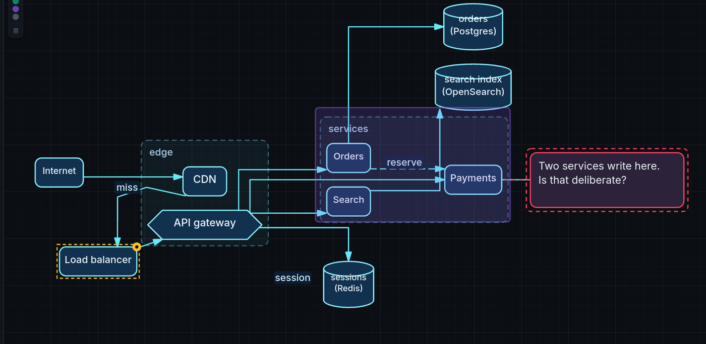
</p>

The pen tray on the left of the canvas gives you four marks:

| | Tool | Key | What it does |
|---|---|---|---|
| 📝 | **Note** | `N` | Click a box to write about it — a line follows the box wherever it goes. |
| ↗ | **Arrow** | `A` | Point at something. |
| 🖍 | **Highlight** | `H` | A wash over the part under discussion. |
| ✏️ | **Draw** | `D` | Freehand ink. |

Five colours, none of them amber — amber means *pinned* and nothing else.

Marks live in the layout file, **never in your diagram source**. They are
included when you export, and they appear in a presentation alongside the box
they are about.

ZDraft is not a drawing program. This layer is for saying *"why two writers
here?"* next to a box — anything more belongs in the diagram itself.

---

## Presenting

<p align="center">
  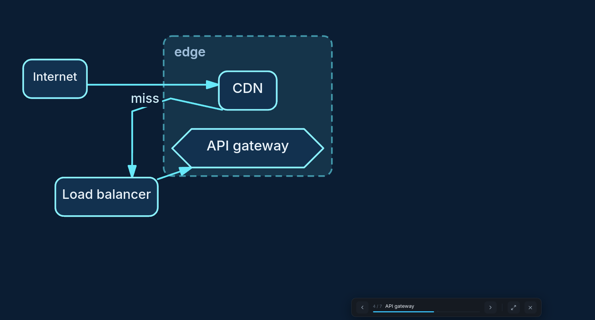
</p>

Press **`F5`**, or the ▷ button in the toolbar.

A finished architecture diagram dropped on a room all at once is a wall. ZDraft
reveals it **in the order it flows** — sources first, then what they reach — so
it reads as a story instead.

- **Space, →, Page Down or a click** — next step
- **←, Page Up, Backspace or a right-click** — back
- **`F`** — fullscreen
- **`Esc`** — stop

Nothing re-layouts between steps. The diagram is fitted once and never moves
again, so a box that appears on step four is exactly where it will still be on
step nine.

Sequence diagrams open on the cast and then play one message at a time. A
markdown file with several diagrams is already a deck — walking off the end of
one moves to the next.

---

## Comparing with git

<p align="center">
  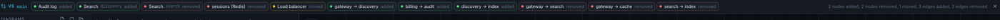
</p>

Press **`Ctrl+Shift+G`**. ZDraft reads the last committed version of your file
*and its layout* and shows what changed **on the diagram itself**:

- 🟢 **added** · 🔴 **removed** · 🟣 **renamed or reshaped** · 🟡 **moved**, with
  a dashed trace back to where it used to sit

<p align="center">
  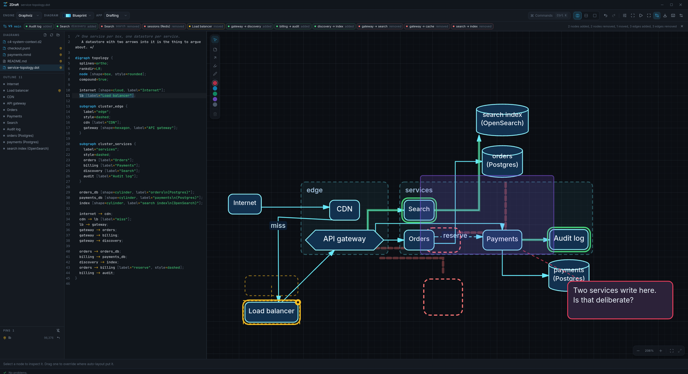
</p>

Every change is listed as a chip. Click one to jump to it. Hover to see whether
you will find it in your **source diff** or in the **layout file** — the same
distinction ZDraft draws everywhere.

This is the payoff for keeping layout in text. A draw.io blob tells a reviewer
"the file changed". This tells them *"you added a queue, renamed the database
and moved the worker."*

---

## Tuning the layout

<p align="center">
  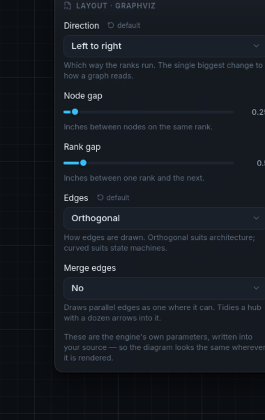
</p>

Before you reach for a pin, try the engine's own knobs — the ⇄ button in the
toolbar. Changing the direction fixes a whole diagram at once, where a pin fixes
one node.

| Knob | Graphviz | Mermaid | D2 | PlantUML |
|---|---|---|---|---|
| Direction | ✅ | ✅ | ✅ | ✅ |
| Node gap | ✅ | ✅ | | |
| Rank gap | ✅ | ✅ | | |
| Edge style | ✅ | ✅ | | |
| Merge parallel edges | ✅ | | | |

These write **one line into your source**, not into the layout file — because
GitHub reads the same line, and your diagram should look the same wherever it is
rendered. The panel shows the source icon to say so.

Setting a knob back to its default removes the line rather than restating it.

---

## Templates and starters

<p align="center">
  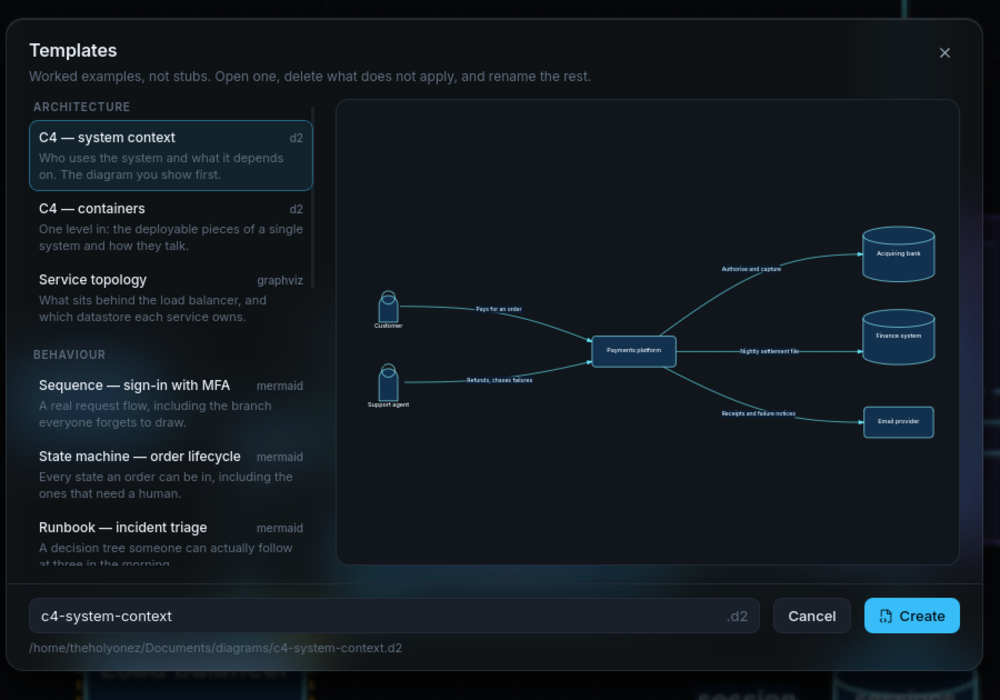
</p>

**`Ctrl+Shift+N`** opens thirteen worked examples with a live preview — real
content, not four boxes called A, B, C and D.

| Category | Templates |
|---|---|
| **Architecture** | C4 system context · C4 containers · Service topology |
| **Behaviour** | Sequence — sign-in with MFA · State machine — order lifecycle · Runbook — incident triage |
| **Data** | Entities — orders and payments · Classes — a domain model · Data pipeline |
| **Infrastructure** | Deployment — two regions · Network — VPC and subnets |
| **People** | Org chart · Service blueprint |

**`Ctrl+N`** gives you a smaller starter instead — a handful of lines that
render, in whichever language you pick.

---

## Importing from draw.io and Excalidraw

<p align="center">
  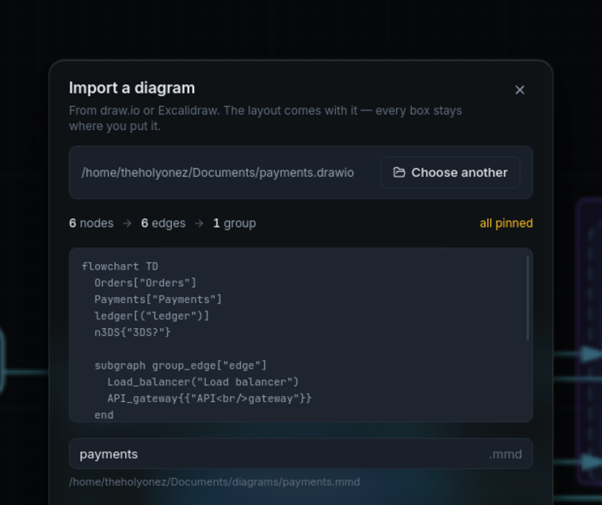
</p>

**`Ctrl+Shift+O`**, or *Import…* in the command palette.

ZDraft reads `.drawio`, `.xml` and `.excalidraw` files and gives you **both
halves**: readable Mermaid, and a layout file that pins every node exactly where
its author put it.

Open the result and it looks like the original. Delete the layout file and it is
a clean auto-laid-out diagram. That choice is yours, made after you can see both.

The dialog shows you the generated source **before** anything is written, along
with anything that could not come across — a freehand scribble, an arrow that
joined nothing, an extra page. Nothing is dropped in silence.

> draw.io compresses its files by default and ZDraft handles that. Excalidraw
> has no concept of a "node", so ZDraft infers them and tells you which
> connections it had to guess.

---

## Diagrams inside markdown

Open a `.md` file and ZDraft finds every fenced diagram in it:

````markdown
<!-- zdraft: auth-flow -->
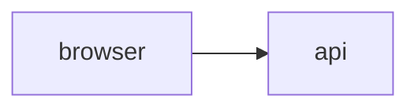
````

A bar above the canvas lets you step between them. Each block keeps its own
layout in one shared `.md.zlayout.toml`.

The `<!-- zdraft: name -->` marker is optional but worth adding: with it, a
block's layout follows the block when you **move it** in the document. Without
one, layout is keyed by position. ZDraft offers to add markers for you.

---

## Exporting

**`Ctrl+E`**.

| Format | Notes |
|---|---|
| **SVG** | Vector, and still text. Three answers to “will this look right on a machine without Inter” — see below. |
| **PNG** | Scaled 1× to 6×. |
| **PDF** | Vector, one page the size of the diagram, with the type drawn as outlines. Prints the same anywhere. |

For SVG you choose what happens to the labels:

| The text | Size | Trade |
|---|---|---|
| **Leave it as text** | Smallest | Selectable and searchable, but needs Inter installed to look right. |
| **Embed the font** | +100 KB | Identical anywhere, and still selectable. |
| **Draw it as outlines** | Middling | Identical anywhere, and no longer letters — nothing to select or search. |

Three buttons beside the format:

- **Copy SVG** — straight to the clipboard, with whichever text option you chose
- **Copy image** — a PNG at the raster scale, for pasting into a chat or a slide
- **Copy source for GitHub** — your file verbatim, ready to paste into an issue
  or a README. Pins live in the layout file, so the source needs no cleaning up.

Exports contain the diagram and your annotations, and none of ZDraft's own
chrome — no pin badges, no selection handles, no grid. Turn the background off
for a transparent PNG to drop on a slide.

---

## Themes

**Diagram themes** change the drawing. They are stored in the layout file, so a
diagram keeps its palette wherever it is opened.

| Theme | Character |
|---|---|
| **Blueprint** | Deep blue, cyan hairlines. The signature look. |
| **Paper** | Warm white and graphite. Reads well printed. |
| **Slate** | Neutral greys. Gets out of the way. |
| **Pastel** | Soft fills, gentle contrast. Good on a projector. |
| **Mono** | Black and white only. Nothing is encoded in colour. |
| **Neon** | Near-black with vivid strokes. Built for dark slides. |

**App themes** change the chrome around it: **Drafting** (the default),
**Blueprint**, **Paper** and **Contrast**.

---

## Every button

Every button names itself on hover. Left to right along the top bar:

| Button | What it does | |
|---|---|---|
| **Engine ▾** | Which language this file is in. | |
| **Diagram ▾** | The diagram's palette, previewed as colour chips. | |
| **App ▾** | The colour of ZDraft itself. | |
| **Commands** | The command palette — every action, plus jump-to-node. | `Ctrl K` |
| **Split** | Source beside the canvas, above it, or canvas only. | `Ctrl \` |
| **Undo** / **Redo** | The tooltip names what it will undo — *"Undo move a node"*. | `Ctrl Z` |
| **Tune the layout** | Direction, spacing and edge style: the engine's own knobs. | |
| **Fit to view** | | `Ctrl ⇧ F` |
| **Present** | Reveal the diagram a step at a time, and nothing else on screen. | `F5` |
| **Zen mode** | Everything but the canvas gets out of the way. | `Ctrl ⇧ D` |
| **Compare with the last commit** | What changed since git, drawn on the diagram. | `Ctrl ⇧ G` |
| **Export** | SVG, PNG, PDF, or copy. | `Ctrl E` |
| **Keyboard shortcuts** | | `Ctrl /` |
| **Settings** | | `Ctrl ,` |

**On the canvas:** the pen tray sits top-left, the zoom controls and minimap
bottom-right. **Right-click** anything — a node, an edge, a mark, empty space —
for what applies to it. Worth knowing about, because a menu is the only place
they live:

| Right-click | |
|---|---|
| a node → **Select connected nodes** | Everything one edge away, selected in one go. Then drag, align or pin the lot. |
| a node → **Separate from neighbours** | Pushes overlapping boxes apart and pins them where they land. |
| an edge → **Select both ends** | The two nodes it joins. |
| an edge → **Clear manual routing** | Drops your bends, back to the engine's own route. |
| a note → **Point at *node*** | Anchors the note to a box, so the line follows it. **Stop pointing at it** cuts it loose. |
| empty space → **Select all nodes** | |

**The left rail** holds your files, an outline of the current diagram, and the
Pins list. **The bar at the bottom** shows what is selected and whether editing
it changes your *source file* or your *layout file* — two different icons, never
ambiguous. Under that, parse errors and layout warnings, with the line to jump
to. Drag its top edge to make it taller.

---

## Settings

`Ctrl+,`

| Setting | |
|---|---|
| **App theme** | The chrome around your diagram. |
| **Default diagram theme** | Used by files that have not chosen one. |
| **Snap to grid** | The grid dragged nodes land on. Hold `Alt` to ignore it. |
| **Show the drafting grid** | The faint rule behind the canvas. |
| **Animate layout changes** | Nodes glide when the layout re-runs, so you can see what moved. Dragging is never animated. |
| **Dim unrelated edges** | With something selected, edges that do not touch it fade back. |
| **Minimap** | An overview in the corner for large diagrams. |
| **Re-render as you type** | Off means the canvas updates on `Ctrl+Enter`. |
| **Line numbers**, **Wrap long lines** | In the source editor. |
| **Layout** | Where the source sits relative to the canvas. |
| **PlantUML** | Install it, or point at a jar you already have. |

Settings are stored on this machine. There is no account and nothing is sent
anywhere.

The second tab, **About**, holds the version, the licence, where to file an
issue, and the full list of what ZDraft is built on — including the engines and
typefaces that travel inside the installer.

---

## Keyboard shortcuts

`Ctrl+/` shows this list inside the app.

### Files

| | |
|---|---|
| `Ctrl` `N` | New diagram |
| `Ctrl` `⇧` `N` | New from a template |
| `Ctrl` `⇧` `O` | Import from draw.io or Excalidraw |
| `Ctrl` `S` | Save the source |
| `Ctrl` `E` | Export |
| `Ctrl` `K` | Command palette |
| `Ctrl` `,` | Settings |
| `Ctrl` `/` | Keyboard shortcuts |
| `Ctrl` `⇧` `G` | Compare with the last commit |

### Editing

| | |
|---|---|
| `Ctrl` `Z` | Undo — one timeline over text *and* layout |
| `Ctrl` `Y` | Redo |
| `Ctrl` `G` | Group the selection into a container |
| `F2` | Rename the selected node — every reference changes, and the pin follows |
| `Ctrl` `⏎` | Re-render now |

### The canvas

| | |
|---|---|
| Drag | Move a node, a subgraph, an edge bend or a label |
| `Alt` drag | Move without snapping to the grid |
| Arrows | Nudge by one, `⇧` for ten |
| `P` | Pin or release the selection |
| Double-click | Drop a bend, or put a label back |
| `⇧` click | Add to the selection |
| Drag on empty space | Marquee select |
| `Space` drag | Pan — middle-drag does the same |
| `Ctrl` scroll | Zoom to the pointer |
| `Ctrl` `+` / `−` | Zoom in and out |
| `Ctrl` `0` | Back to 100% |
| `Ctrl` `⇧` `F` | Fit the diagram |
| `Esc` | Clear the selection |

### Marking up

| | |
|---|---|
| `V` | Back to the pointer |
| `N` | Note |
| `A` | Arrow |
| `H` | Highlight |
| `D` | Draw freehand |
| `Del` | Delete the selected marks |
| Double-click | Edit a note |

### Presenting

| | |
|---|---|
| `F5` | Present |
| `Space` | Next step — `→`, Page Down and a click do the same |
| `⇧` click | Back a step — `←`, Page Up and a right-click too |
| `F` | Fullscreen |
| `Esc` | Stop presenting |

### Layout

| | |
|---|---|
| `Ctrl` `\` | Cycle the split: side, stacked, canvas only |
| `Ctrl` `B` | Show or hide the sidebar |
| `Ctrl` `⇧` `D` | Zen mode |
| `/` | Jump to a node by name |

> On Linux, `Ctrl+Shift+Z` is usually claimed by the system before ZDraft sees
> it, which is why redo is advertised as `Ctrl+Y`.

---

## The command line

ZDraft ships a CLI that renders your diagrams **with their pins applied** —
which is the point of it. A tool that rendered only the source would quietly
publish the auto-laid-out version, the one you overrode.

```sh
pnpm --filter @zdraft/cli build

node packages/cli/dist/zdraft.js render docs/ --out build/
node packages/cli/dist/zdraft.js watch  docs/ --out build/
```

| Option | |
|---|---|
| `-o, --out <dir>` | Where the SVGs go. Default: beside each source file. |
| `--theme <name>` | Diagram theme. A file's own theme still wins. |
| `--padding <n>` | Space around the diagram. |
| `--no-background` | Transparent, for dropping onto a slide. |
| `--no-pins` | Ignore the layout files and render pure auto-layout. |
| `--layout <prog>` | Graphviz program: `dot`, `neato`, `fdp`, `circo`, `twopi`. |
| `--strict` | Treat warnings as failures. For CI. |
| `-q, --quiet` | Print nothing but errors. |

It exits non-zero when a diagram fails to parse, so CI can check that the
committed picture still matches the committed source **and** the committed
layout.

Watch mode re-renders when you edit the source *or* the layout — so dragging a
node in the app updates the rendered file.

Graphviz and D2 render exactly as they do in the app. **Mermaid does not**: it
lays out by measuring rendered text and gets that wrong without a browser, so
the CLI refuses it rather than writing a diagram with every node stacked on the
origin.

---

## PlantUML setup

<p align="center">
  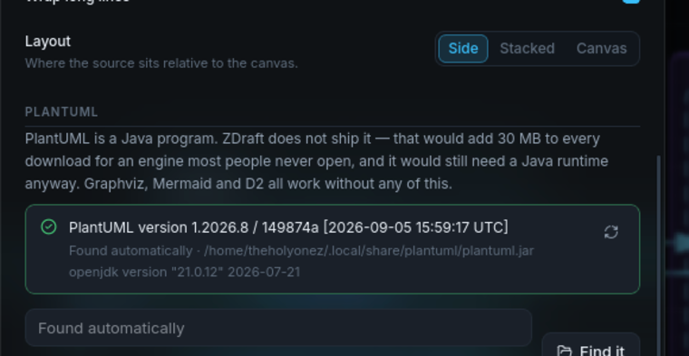
</p>

PlantUML is a Java program. ZDraft does not ship it — that would add 30 MB to
every download for an engine most people never open, and it would still need a
Java runtime anyway. **Graphviz, Mermaid and D2 all work without any of this.**

If you want it:

1. **Install Java** if you have not got it — `sudo pacman -S jre-openjdk`,
   `sudo apt install default-jre`, or [adoptium.net](https://adoptium.net) on
   Windows.
2. Open **Settings → PlantUML** and press **Install PlantUML**. ZDraft downloads
   it (~30 MB) into `~/.local/share/plantuml`, checks that it runs, and your
   diagram renders.

This is the only time ZDraft ever uses the network, and only because you asked.

**Prefer to do it yourself?** Install your distribution's package
(`sudo pacman -S plantuml`, `sudo apt install plantuml`) and ZDraft will find
it. Or drop `plantuml.jar` into `~/.local/share/plantuml/` — or anywhere you
like, and point Settings at it.

---

## Questions

**Does my diagram still work on GitHub?**
Yes. ZDraft never rewrites your source to store layout, so a Mermaid file stays
a Mermaid file and GitHub renders it exactly as before. **Copy source for
GitHub** in the export dialog hands you the file verbatim.

**What happens if I delete the `.zlayout.toml`?**
The diagram goes back to pure auto-layout. There is no cache, no database and no
hidden state that has to agree with it — that is the whole point of keeping
layout in one readable file beside your source.

**Can I use ZDraft without ever dragging anything?**
Yes. It is a perfectly ordinary diagram editor with live preview, four engines,
templates and export. The layout file is only created when you actually move
something.

**Do I need Graphviz, Node or anything else installed?**
No. Graphviz, Mermaid and D2 are compiled into the app. Only PlantUML needs
something extra, and it tells you what.

**Does anything leave my machine?**
No. There is no account, no telemetry and no sync. The only network request
ZDraft can make is downloading PlantUML, and only when you press that button.

**Does it work offline?**
Entirely.

**What about macOS?**
Not a target. Linux and Windows are.

**How do several people work on one diagram?**
Normally, through git. The source is text and the layout is text, so both merge.
When two people move the same node, you get a four-line conflict you can read —
and ZDraft can resolve it on the canvas.

**Is it really free?**
GPL-3.0-or-later, free forever, no paid tier and nothing gated. Donations are
welcome and change nothing.

---

## Building from source

Requires Node 22+, pnpm 10, Rust 1.85+, and the
[Tauri v2 system dependencies](https://v2.tauri.app/start/prerequisites/).

```sh
pnpm install
pnpm tauri dev
```

```sh
cargo test            # Rust: layout files, atomic writes, folder walk, git blobs
pnpm test             # TypeScript: the engine, and the CLI over the same core
pnpm --filter @zdraft/cli build
```

---

## Where things are

| | |
|---|---|
| **[zsync.eu/zdraft](https://zsync.eu/zdraft/)** | ZDraft's home. Downloads, screenshots, and what is new. |
| **[github.com/TheHolyOneZ/ZDraft](https://github.com/TheHolyOneZ/ZDraft)** | The source, and where to file an issue. |
| **[zsync.eu](https://zsync.eu/)** | Everything else I have built. |
| **[zlogic.eu](https://zlogic.eu/)** | Game mods and mod menus, which are a different job entirely. |

The installers are only on the site. GitHub carries the code, the issues and
the history — releasing binaries in two places is how one of them quietly goes
stale.

---

## Licence

GPL-3.0-or-later. Copyright © 2026 TheHolyOneZ.

Free forever. If it saves you an afternoon, donations are welcome — but nothing
is ever gated.
